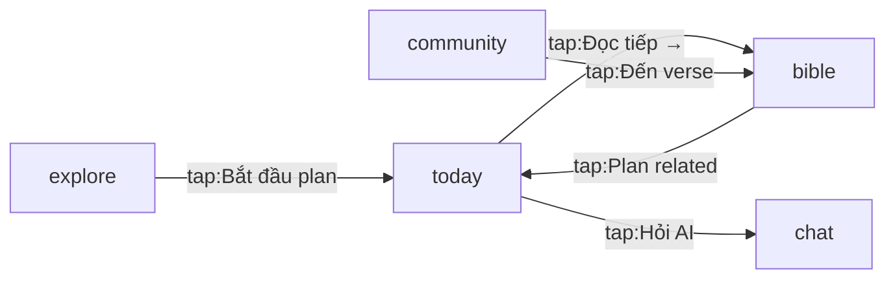

# BibleChat — App Overview

> **Layer 5 / 5 — app-level platform-agnostic spec.** Tổng hợp 5 feature
> (today / chat / community / bible / explore) thành 1 nguồn truyền đạt sản
> phẩm. Dùng được cho cả iOS rebuild và stake-holder không kỹ thuật.
>
> Đây là **canonical sample** — minh hoạ cách điền prose section abstract.

---

## 1. App identity

<!-- AUTO:IDENTITY START -->
| Field | Value |
|---|---|
| **App** | BibleChat |
| **Package (Android)** | `com.basmo.BibleChat` |
| **Locale chính** | vi-VN |
| **Viewport capture** | 1080×2160 px |
| **Stack ghi nhận** | compose |
<!-- AUTO:IDENTITY END -->

---

## A. Mục tiêu sản phẩm

App đọc Kinh Thánh + chat AI giúp user tương tác sâu với content tôn giáo:

- **Target user**: tín đồ Cơ-đốc, đọc Kinh Thánh hằng ngày, có nhu cầu Q&A
  thần học cá nhân hoá. Locale chính tiếng Việt; planning roll-out tiếng Anh.
- **Value prop chính**: "1 app cho cả 3 thói quen — đọc nhật ký Today, lookup
  câu Kinh Thánh, hỏi chuyên sâu qua chat AI". Cạnh tranh với YouVersion
  (đọc-only) + ChatGPT (chat-only) bằng cách kết hợp 2 trải nghiệm.
- **KPI**:
  - DAU/MAU ≥ 0.45 (sticky cao do thói quen đọc hằng ngày)
  - Chat session ≥ 3 turn / session (vs ChatGPT 1.8 baseline)
  - Day-7 retention ≥ 35% (industry median 25%)

---

## 2. Feature inventory

<!-- AUTO:INVENTORY START -->
| Feature | Screens | Blocks | Components | APIs | Data models | Invariants | Open Q | AC |
|---|---:|---:|---:|---:|---:|---:|---:|---:|
| `today` | 17 | 12 | 9 | 4 | 6 | 3 | 5 | 8 |
| `chat` | 9 | 6 | 5 | 3 | 4 | 2 | 3 | 6 |
| `community` | 12 | 8 | 6 | 5 | 5 | 1 | 4 | 5 |
| `bible` | 14 | 10 | 8 | 4 | 7 | 4 | 6 | 9 |
| `explore` | 11 | 7 | 4 | 3 | 3 | 1 | 2 | 4 |
<!-- AUTO:INVENTORY END -->

---

## 3. Sitemap

<!-- AUTO:SITEMAP START -->
### today

| Anchor | Label | Hash | Capture |
|---|---|---|---|
| `today/screen/landing` | Today Landing | `a1b2c3d4e5f6` | `screen_01_landing.png` |
| `today/screen/verse_session_reader` | Verse Session Reader | `f6e5d4c3b2a1` | `screen_02_verse.png` |
| ... (15 more) | | | |

### chat

| Anchor | Label | Hash | Capture |
|---|---|---|---|
| `chat/screen/landing` | Chat List | `1234567890ab` | `screen_01_landing.png` |
| ... (8 more) | | | |
<!-- AUTO:SITEMAP END -->

---

## 4. Cross-feature navigation

<!-- AUTO:CROSS_NAV START -->

<!-- AUTO:CROSS_NAV END -->

---

## B. Navigation model

- **Bottom-nav 5 tab** là cấu trúc primary. Cold launch land trên `today`. Tab
  switch giữ scroll-state per-tab (cross-tab back KHÔNG go through stack).
- **Modal pattern**: full-screen modal cho destructive (paywall, account
  deletion); bottom-sheet cho contextual action (share verse, plan card menu);
  inline expand cho tertiary (note edit). Modal full-screen có "X" top-left
  dismiss; sheet có swipe-down.
- **Back behavior**: trong tab, back đi trong stack tab đó. Cross-feature nav
  (tap "Đọc tiếp" từ today → bible) tạo deep-link, back từ bible **không**
  về today (jump cut). Designer chấp nhận trade-off này để tránh confusion.
- **Deep-link strategy**: external link vào `verse/<book>/<chapter>/<verse>`
  hoặc `plan/<id>`. App lạnh (không session active) thì dẫn qua splash ngắn
  (≤ 800ms) trước khi land on target.

---

## 5. Component reuse map (auto-detect)

<!-- AUTO:REUSE_MAP START -->
| reuse_key | Used by features | Count | Anchors |
|---|---|---:|---|
| `session_reader` | bible, community, today | 3 | `today/component/session_reader`, `bible/component/session_reader`, `community/component/session_reader` |
| `chapter_reader` | bible, today | 2 | `today/component/chapter_reader`, `bible/component/chapter_reader` |
| `verse_card` | community, today | 2 | `today/component/verse_card`, `community/component/verse_card` |

> **Designer note**: mỗi reuse_key trên là ứng viên cho 1 component design
> system thực sự — engineer rebuild 1 lần, parameterise.
<!-- AUTO:REUSE_MAP END -->

---

## C. UX state pattern

Quy ước trên toàn app, áp dụng cho mọi feature:

- **Empty state**: 1 illustration trung tâm + 1 dòng heading + 1 dòng sub +
  1 primary CTA. Không lồng ghép tip / multiple CTA.
- **Loading**: skeleton placeholder ≥ 200ms để tránh flash; spinner chỉ
  cho submit action ngắn (< 2s). Loading > 5s có 1 dòng "đang tải..." +
  estimate.
- **Error**: inline cho field-level (red text dưới input); toast cho
  transient (mất mạng); dialog cho terminal (account locked). Không bao
  giờ block toàn screen trừ paywall/auth.
- **Paywall**: full-screen modal có "X" close, không bao giờ trap user.
  CTA primary "Try for Free", CTA tertiary "Restore" + "Maybe later".
- **Gating**: feature lock có icon khoá nhỏ + tooltip on tap; không hide
  hoàn toàn. User phải biết feature tồn tại để nâng cấp.

---

## 6. API surface

<!-- AUTO:API_SURFACE START -->
| Method | Path | Feature | Returns | Anchor |
|---|---|---|---|---|
| `GET` | `/v1/today/{date}` | `today` | `today/data_model/day_card` | `today/api/get_day` |
| `GET` | `/v1/bible/{book}/{ch}/{v}` | `bible` | `bible/data_model/verse` | `bible/api/get_verse` |
| `POST` | `/v1/chat/turn` | `chat` | `chat/data_model/turn` | `chat/api/post_turn` |
| ... | | | | |
<!-- AUTO:API_SURFACE END -->

---

## 7. Data models

<!-- AUTO:DATA_MODELS START -->
| Anchor | Name | Feature |
|---|---|---|
| `today/data_model/day_card` | DayCard | `today` |
| `today/data_model/streak` | Streak | `today` |
| `bible/data_model/verse` | Verse | `bible` |
| ... | | |
<!-- AUTO:DATA_MODELS END -->

---

## D. Content / copy rules

- **Tone**: thân thiện, ngắn (< 50 ký tự cho heading). Tránh từ
  imperative gắt ("Hãy", "Phải") — dùng câu hỏi mời ("Bạn muốn ...?").
- **Locale**: tiếng Việt mặc định. Tiếng Anh roll-out tự động khi
  `device.locale` start với `en`. KHÔNG mix 2 locale trong cùng screen.
- **Format ngày**: `dd/MM/yyyy` cho vi, `MMM d, yyyy` cho en. Không bao
  giờ "yesterday" / "hôm qua" trong UI — luôn date tuyệt đối để tránh
  ambiguity timezone.
- **Plural**: vi không có plural form (giữ nguyên "1 bài", "5 bài" — chỉ
  số đổi). en dùng ICU `plural` rule.
- **RTL**: chưa support (Arab/Hebrew). Plan v2.

---

## 8. Cross-feature invariants

<!-- AUTO:INVARIANTS START -->
| Anchor | Feature | File:line |
|---|---|---|
| `today/invariant/streak_persists` | `today` | `spec/feature/today/today_feature_spec.md:340` |
| `chat/invariant/turn_order` | `chat` | `spec/feature/chat/chat_feature_spec.md:180` |
| `bible/invariant/verse_singleton` | `bible` | `spec/feature/bible/bible_feature_spec.md:220` |
<!-- AUTO:INVARIANTS END -->

---

## 9. Open questions roll-up

<!-- AUTO:OPEN_QUESTIONS START -->
| Anchor | Feature | First line |
|---|---|---|
| `today/question/q_03` | `today` | ### Q-03: Streak reset có grace period không? |
| `chat/question/q_01` | `chat` | ### Q-01: Lưu lịch sử chat bao lâu? |
<!-- AUTO:OPEN_QUESTIONS END -->

---

## 10. Acceptance criteria roll-up

<!-- AUTO:ACCEPTANCE START -->
| Anchor | Feature | Summary |
|---|---|---|
| `today/criterion/ac_01` | `today` | Landing render trong 1s lúc cold start |
| `today/criterion/ac_02` | `today` | Streak number update ngay sau khi mark verse done |
| `chat/criterion/ac_01` | `chat` | Streaming token render < 100ms latency p50 |
<!-- AUTO:ACCEPTANCE END -->

---

## E. Cross-cutting design decisions

- **Auth**: SSO duy nhất qua Google/Apple. Không cho register email/password —
  giảm friction onboarding. Trade-off: user không muốn link Google account
  thì bỏ → đã chấp nhận theo data: < 5% drop tại auth screen.
- **Audio mini-player**: persist khi nav cross feature (today → chat → bible
  vẫn play tiếp). Mini-player là singleton render outside feature scope.
- **Theme**: light/dark switch instant, không reload screen. Theme value
  store local (không sync server) — designer quyết theo OS preference + user
  override per-device.
- **Offline**: cache 7 ngày nội dung Today + verse đã đọc. Chat tuyệt đối
  online (LLM call). Community read offline được, post phải online.
